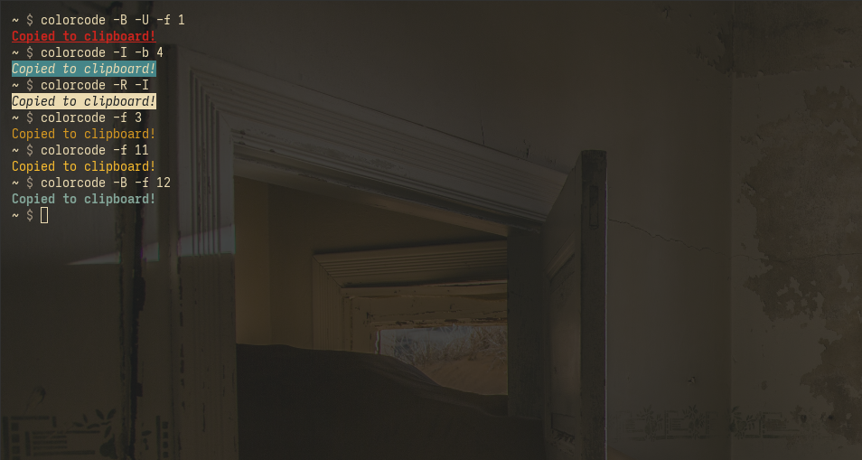

# colorcode

This command line program takes text colors and attributes and returns the corresponding [ANSI escape sequence](https://stackoverflow.com/questions/4842424/list-of-ansi-color-escape-sequences), copying it to the clipboard.



```
Usage: colorcode [OPTIONS]
Options:
  -h, --help                Print this help message and exit.
  -r --reset                Returns the 'reset/normal' escape sequence
  -f --foreground [0,15]    Sets the foreground color of the escape sequence to the following terminal color.
  -b --background [0,15]    Sets the background color of the escape sequence to the following terminal color.
  -B --bold                 Sets the escape sequence to contain the 'bold'attribute.
  -I --italic               Sets the escape sequence to contain the 'italic' attribute.
  -U --underline            Sets the escape sequence to contain the 'underline' attribute.
  -R --reverse              Sets the escape sequence to contain the 'reverse' attribute.
```
